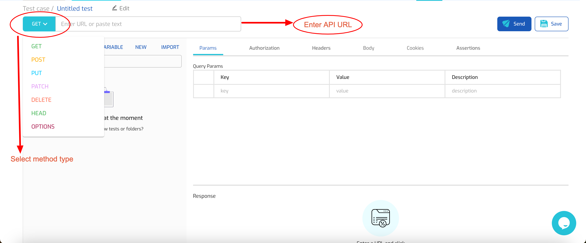

# API Testing

Create a basic API request

<figure><figcaption></figcaption></figure>

On the Scandium API runner interface, you are able to create a new API request. To create an API test, you need to select the method of the request and provide the API URL (endpoint).

Press the Send button to initiate the request or press the Save button to save the request.

You can change the name/title of the request before and after saving:

<figure><figcaption></figcaption></figure>

Enter the desired name for your test case and press the Save button.

#### Try an example request

Method Type: GET

API URL:  [https://api.edudream.fr/location/country](https://api.edudream.fr/location/country)

<figure><figcaption>
An API request with sample response
</figcaption></figure>

#### Additional information on API requests

The Scandium API runner interface allows you to add additional information to your API requests where needed.

**Query parameters:** Can be added from the 'Params' tab

<figure><figcaption></figcaption></figure>

**Authorization:** Scandium supports multiple authorization types out of the box, including Bearer Token, Basic Auth, API Key, Digest Auth, Oauth 1.0

<figure><figcaption></figcaption></figure>

**Headers:** You can add several header key-values as required by your API

<figure><figcaption></figcaption></figure>

**Body:** Scandium supports multiple body types as payload for your request. This includes: form-data, x-www-form-urlencoded, JSON,  XML,  Text, HTML and GraphQL.

<figure><figcaption></figcaption></figure>

### Adding assertions to API requests

When you make API requests, you want to validate that the request outcome meets your expectations. With Scandium API Runner, you can add assertions to your API tests. To add. these assertions, click on the 'Assertions' tab.

You can add assertions for the following:

* Status code
* Response header
* Response body type
* Response body content
* Request duration

<figure><figcaption></figcaption></figure>

To add an assertion, &#x20;

1. Select the assertion type.
2. Select a condition for the assertion.
3. Input the value to be checked for.

<figure><figcaption>
Select assertion operator/condition
</figcaption></figure>

<figure><figcaption>
Enter assertion value to check for
</figcaption></figure>

You can also combine multiple assertions for one request.

### Viewing API Response

After sending your API requests, you can see the response to your requests in the tab below the request area.

This tab shows you the status code, the duration of the request, the size of the response and the content of the response. You can view the body of the response in JSON, look at the headers and also inspect the Assertions Result tab  for result of the assertions you added.

<figure><figcaption>
Response body
</figcaption></figure>

<figure><figcaption>
Assertion result
</figcaption></figure>

### Variables in requests

Variables make it easy to reuse a value in multiple API tests. For example, imagine the  APIs you are testing have the base url `https://example.com/api`. This part of the URL is common to all endpoints,  such that a login endpoint would like `https://example.com/api/login` while a registration endpoint would like `https://example.com/api/register`.

Now imagine you want to test these APIs across different environments such as staging, test and production, where all these environments have different base URLs. Normally, you'd   have to update all test cases with the specific environment URL each time you want to run your API test against such environment.

But if you create the base URL as a variable, you'd only have to make the change once.

#### How to create a variable

You can create a variable by clicking on the Variable submenu

<figure><figcaption></figcaption></figure>

From the modal that appears, you can then add the names and values for your variables. You can add as many variables as you need.

<figure><figcaption></figcaption></figure>

Click on the Save button to save your newly added variable.

#### Using a variable (How to make reference to a variable)

Once you have created a variable, it will be available for you to use within your tests. Variables can be used in the endpoint field, headers, parameters and body of the request.

To reference a variable, type `{{` (two curly braces), this will bring up a suggestion of the list of variables available, you can then select one from the list.

<figure><figcaption>
Choose a variable from the suggestion
</figcaption></figure>

<figure><figcaption>
Variable plus other string
</figcaption></figure>

When  the request is sent,  the variable (denoted by `{{base_url}}`) will get replaced by its value which in this case is [`https://api.edudream.fr`](https://api.edudream.fr)&#x20;
